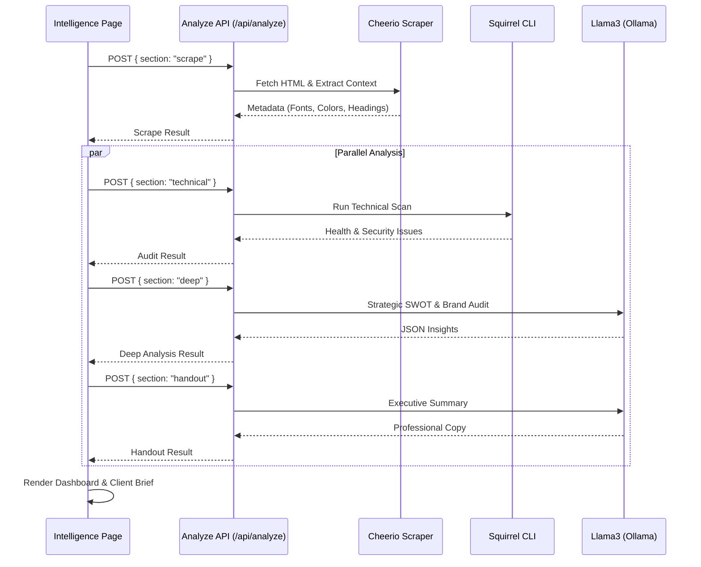

# Intelligence Flow: Progressive Analysis System

This document provides a technical explanation of the **Intelligence** feature in LaunchPad. It covers the architecture, sequence of operations, and the data transformation process that powers the professional brand audits.

## Overview

The Intelligence system is a **Progressive Analysis** engine that transforms a raw website URL into a multi-layered strategic report. It utilizes a combination of traditional web scraping, specialized security/SEO auditing tools, and Large Language Models (LLMs) to provide deep insights.

## Architecture

The system follows a sequential orchestration pattern handled primarily by the frontend to provide real-time feedback to the user.

## Internal Workflow

The analysis is divided into four distinct phases (quadrants) to optimize performance and ensure high-quality data.

### 1. The Scrape Phase (`scrape`)
The foundation of the analysis.
- **Tooling**: `axios` for fetching, `cheerio` for parsing.
- **Output**: Core Web Vitals (TTFB), Page Size, SEO title/description, and a **Data DNA** extraction (dominant colors, font families, and H1-H3 headings).

### 2. The Technical Audit (`technical`)
A professional-grade health check.
- **Tooling**: `squirrel` CLI.
- **Output**: Health scores, accessibility issues, and security vulnerabilities. This data is cached to avoid redundant heavy scans.

### 3. Deep Strategic Analysis (`deep`)
The "brain" of the operation.
- **Tooling**: LLM (Llama3).
- **Process**: The system sends the extracted "Data DNA" (headings, styles, body text) to the LLM with a highly specific system prompt.
- **Output**:
    - **Visual Audit**: Categorization of graphic style (e.g., "Bento Grid Minimalism").
    - **SWOT**: 4 detailed observations for Strengths, Weaknesses, Opportunities, and Threats.
    - **Agency Roadmap**: Technical debt identification and growth hacks (Viral loops, SEO strategy).

### 4. Executive Handout (`handout`)
Synthesis for client presentation.
- **Tooling**: LLM (Llama3).
- **Output**: Executive summary and professional conclusion formatted specifically for the PDF report.

## Data Representation

The final data is passed to the `ClientBrief` component, which is a print-optimized, high-contrast UI designed to look like a premium agency handout. It includes:
- **Executive Health Score**: A weighted average of technical and performance metrics.
- **SWOT Matrix**: Interactive visualization of strategic points.
- **Growth Roadmap**: Actionable steps for the client.

## Error Handling & Reliability

- **Graceful Degradation**: If an LLM call fails or returns malformed JSON, the API provides a "stable fallback" object to ensure the UI remains functional.
- **Cache Layer**: Technical and Deep analyses are cached in-memory with a TTL to prevent excessive API costs and improve response times for repeat URLs.
